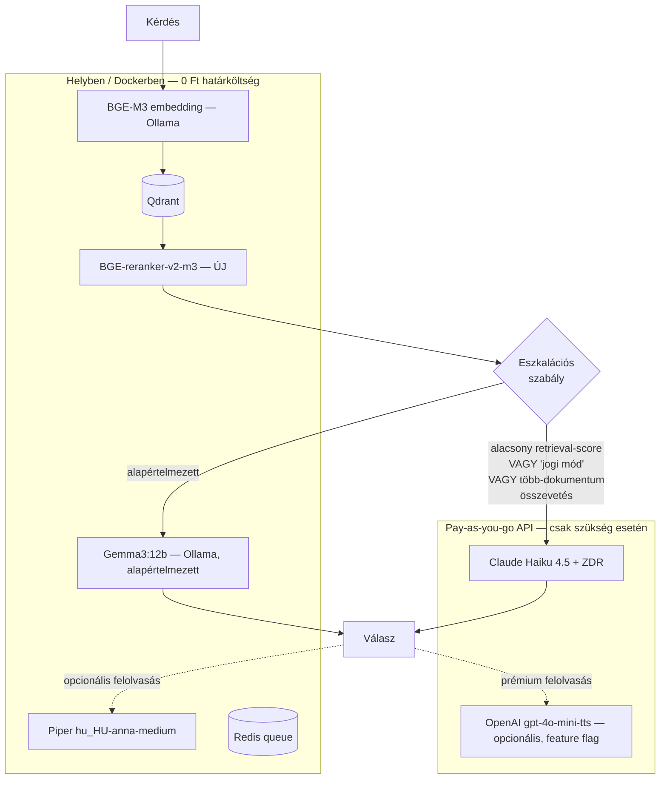

# AI Költség- és Architektúra-stratégia — RAG + TTS Pipeline Audit

**Dátum:** 2026-07-06
**Hatókör:** `ai-rag/` FastAPI mikroszolgáltatás (Ollama + Qdrant + Redis + Piper), Laravel integráció
**Kontextus:** Bootstrap fázisú startup, Hetzner VPS + Coolify éles környezet (lásd `serverKonf.md`), fejlesztői gép: Ryzen 5 9700x / 16 GB VRAM / 16 GB RAM

---

## Vezetői összefoglaló

A kódbázis auditja alapján a jelenlegi RAG-pipeline **már jobb állapotban van**, mint amit a feladat kiinduló feltételezése ("BGE-M3 kérésre töltődik be, cold-start van") sugall — a `rag-service/app/main.py`-ban már létezik egy induláskori bemelegítő (`_warmup_models`) és `OLLAMA_KEEP_ALIVE=24h`, ami a modellek nagy részét VRAM-ban tartja. A valódi maradék szűk keresztmetszetek: (1) a health-check nem várja meg a bemelegítést, (2) a bemelegítés egyszeri, nem öngyógyító, (3) nincs reranker, (4) a hang-asszisztens és az LLM-választás API-alternatíváit még nem vetettük össze számszerűen a helyi futtatással.

**A pénzügyi végkövetkeztetés rövidre zárva:** alacsony (havi néhány száz–néhány ezer lekérdezés) forgalom mellett egy bérelt GPU (RunPod/Vast.ai RTX 4090, kb. **210–500 USD/hó**, ha 0–24-ben fut) **50–1000×-esen drágább**, mint egy olcsó, intelligens API (Claude Haiku 4.5, GPT-4o-mini, Gemini Flash) — mert a bérelt GPU-ért *üzemidő* alapján fizetsz, az API-ért pedig *tényleges használat* alapján. A már meglévő, saját tulajdonú fejlesztői/szerver hardver viszont mindkettőnél olcsóbb marad (nulla határköltség), ezért **nincs ok a helyi Ollama-stack teljes lecserélésére** — a helyes lépés egy **hibrid útválasztás**: a tömeges forgalom marad helyben, a jogi/megfelelőségi szempontból kritikus lekérdezések API-ra terelődnek.

---

## 1. Startup felhő-ökonómia és API hozzáférhetőség

### 1.1 Pay-as-you-go működés és adatvédelem

Mindhárom nagy szolgáltató (Anthropic, OpenAI, Google) **kártyás, azonnali, szerződés nélküli API-hozzáférést** kínál — nincs minimum elköteleződés, nincs sales call, a fiók percek alatt regisztrálható, a számlázás előre feltöltött kredit vagy utólagos havi elszámolás. Ez pontosan megfelel egy bootstrap startup igényeinek.

**Adatvédelmi státusz (kritikus a jogi/vállalati dokumentumok miatt):**

| Szolgáltató | Alapértelmezett tréning-tiltás | Zero Data Retention (ZDR) | Megjegyzés |
|---|---|---|---|
| **Anthropic (Claude API)** | Igen, az API-forgalmat alapból nem használják tréningre | Igényelhető, nincs elköteleződési minimum, a compliance oldalon önkiszolgáló jelentkezés | A legújabb, csúcsmodell (Fable 5) **kizárja** a ZDR-t (min. 30 napos megőrzés kötelező) — de a released, olcsó réteg (**Haiku 4.5**, Sonnet) ZDR-kompatibilis |
| **OpenAI (API)** | Igen, alapból nem tréningadat | Igényelhető ("Zero Data Retention" jelentkezés), nem gátolt nagyvállalati szerződéshez | 30 napos alapértelmezett megőrzés visszaélés-monitorozásra, ZDR ezt nullázza |
| **Google Gemini API** | **Csak a fizetős tier-en!** A Gemini API ingyenes (free tier) szintjén Google **felhasználhatja** a promptokat termékfejlesztésre — ez éles vállalati/jogi dokumentumnál kizáró ok | Fizetős tier alatt elérhető | **Mindenképp fizetős API-kulcsot kell használni**, sosem az ingyenes kvótát |
| **DeepSeek API** | Nem publikusan garantált a nyugati normák szerint | Nem releváns | Kínai joghatóság alá tartozik (állami hozzáférési kockázat, GDPR-transzfer probléma) — **kizárva** érzékeny magyar vállalati/jogi anyagoknál, függetlenül az árától |

**Következtetés:** Anthropic és OpenAI API-k ZDR-rel kombinálva megfelelő adatvédelmi szintet nyújtanak jogi dokumentumokhoz is. A Gemini API-nál kizárólag a fizetős tier használható. A DeepSeek API-t — bármilyen olcsó is — **ki kell zárni** ennél az adattípusnál; a DeepSeek nyílt súlyú modelljei *helyben* futtatva technikailag opció lennének, de ez már nem "API", hanem saját hosztolás (lásd 3. fejezet).

### 1.2 Költség-összehasonlítás: 1000 vállalati RAG lekérdezés

**Módszertan:** a jelenlegi kód (`config.py`, `rag.py`) alapján egy tipikus lekérdezés kontextusa: `top_k=8` chunk × ~600 karakter ≈ 4800 karakter (~1200–1600 token magyarul, a magyar toldalékolás miatt ~1,3× token/karakter szorzóval számolva), plusz rendszerprompt (a `SYSTEM_PROMPT` kb. 500–600 token) és rövid előzmény. Ez **~2000 bemeneti tokent** ad lekérdezésenként. A válasz (Markdown-formázott, táblázatos/felsorolásos) jellemzően **~400 kimeneti token**.

| API / modell | Ár (input / output, $/1M token) | Költség / 1000 lekérdezés |
|---|---:|---:|
| **Claude Haiku 4.5** | $1.00 / $5.00 | **$4.00** |
| Gemini 2.5 Flash | $0.30 / $2.50 | $1.60 |
| GPT-5 mini | $0.25 / $2.00 | $1.30 |
| Gemini 2.5 Flash-Lite | $0.10 / $0.40 | $0.36 |
| GPT-4o-mini | $0.15 / $0.60 | $0.54 |
| DeepSeek V4 Flash | $0.14 / $0.28 | $0.39 *(kizárva — lásd 1.1)* |

*(2026 közepi listaárak; a modellek gyorsan cserélődnek, az arányok — nem az abszolút számok — a lényegesek.)*

**Dedikált bérelt GPU (RunPod / Vast.ai, RTX 4090-osztály):**

| Bérlés módja | Óradíj | Havi költség (0–24) | Havi költség (napi 10 óra, 22 munkanap) |
|---|---:|---:|---:|
| Vast.ai (interruptible) | ~$0.29–0.31/h | ~$210–225 | ~$64–68 |
| RunPod Community Cloud | ~$0.34/h | ~$245 | ~$75 |
| RunPod/Vast Secure/On-demand | ~$0.59–0.69/h | ~$425–500 | ~$130–150 |

A bérelt GPU-nál **időért** fizetsz, nem lekérdezésért — a számla ugyanaz akkor is, ha 1 vagy 100 000 kérdés fut le rajta aznap. Ezért a törésponti (break-even) számítás a releváns kérdés, nem a nyers "$/1000 kérdés" szám:

- Claude Haiku 4.5-tel szemben (kb. **$4/1000 kérdés** = $0.004/kérdés): egy $75/hó GPU-bérlés kb. **~19 000 kérdés/hónál** térülne meg.
- GPT-4o-mini-vel szemben ($0.00054/kérdés): a törés kb. **~140 000 kérdés/hónál** van.

Egy korai fázisú startup havi néhány száz–néhány ezer RAG-lekérdezésnél tart. **Ebben a tartományban a bérelt GPU minden forgatókönyvben veszít** — kizárólag akkor térülne meg, ha a forgalom nagyságrendekkel nő. A jelenlegi, **már meglévő, saját tulajdonú** fejlesztői/szerver hardver (Ryzen 5 9700x + 16 GB VRAM, illetve a Hetzner VPS) ennél is jobb: ott a határköltség gyakorlatilag nulla (csak áram + amortizáció), tehát **a bérelt GPU-ra váltás jelenleg semmilyen forgalmi szinten nem indokolt** — a kérdés csak az, hogy a *már futó* helyi stack mellé mikor érdemes API-lekérdezést is bekapcsolni (lásd 5. fejezet).

---

## 2. Nulla költségű architekturális javítások (BGE-M3 / Ollama cold-start)

**Fontos korrekció a kiinduló feltételezéshez képest:** a kód már tartalmaz bemelegítést. A `rag-service/app/main.py`-ban:

```python
async def _warmup_models() -> None:
    """Embedding + LLM betöltése a VRAM-ba induláskor..."""
    ...
```

ez a `lifespan` alatt `asyncio.create_task`-ként fut, és a `config.py`-ban `ollama_keep_alive: str = "24h"` biztosítja, hogy a modellek ne ürüljenek ki tétlenségben. Ez **jelentősen** csökkenti a cold-start problémát a klasszikus "5 perc után kiürül a VRAM" Ollama-alapértelmezéshez képest. A `setupLlmRag.md`-ben dokumentált "az első kérdés lassú" tünet minden bizonnyal **verseny­helyzetből** (race condition) ered: a konténer/health-check korábban "egészségesnek" jelzi magát, mint ahogy a bemelegítés ténylegesen lefut, vagy a natív Windows Ollama a rag-api újraindítása nélkül, önmagában ürül ki (pl. gépújraindítás után).

Az alábbi 3 lépés **kizárólag meglévő, ingyenes eszközökkel**, kódmódosítással oldja meg a maradék rést — **1 fillér extra infrastruktúra nélkül**:

### 2.1. lépés — Readiness gate: a health-check várja meg a bemelegítést

Jelenleg a `/health` azonnal `{"status": "ok"}`-ot ad, függetlenül a `_warmup_models()` állapotától — így a Docker healthcheck (és élesben a Coolify/Traefik) korábban enged forgalmat, mint ahogy a modellek ténylegesen a VRAM-ban vannak. Vezessünk be egy warmup-flag-et:

```python
# main.py
_warmup_done = False

async def _warmup_models() -> None:
    global _warmup_done
    try:
        ...  # meglévő logika
    finally:
        _warmup_done = True

@app.get("/health")
async def health() -> dict:
    return {"status": "ok", "warm": _warmup_done}
```

A Docker Compose healthcheck-et pedig szigorítsuk (`curl`/`python` ellenőrzés a `warm: true`-ra), így a konténer csak akkor jelentkezik "healthy"-nek, ha a modellek tényleg készen állnak — az első valós felhasználói kérdés soha többé nem futhat bele hidegindításba.

### 2.2. lépés — Öngyógyító, periodikus re-warm (nem egyszeri)

A jelenlegi `_warmup_models()` **egyszeri** feladat induláskor. Ha az Ollama konténer/folyamat a `rag-api` újraindítása *nélkül* esik ki (OOM, driver-hiba, VPS-újraindítás Coolify alatt csak az egyik szolgáltatást érinti), a rendszer csendben visszaesik a hidegindításos állapotba, és csak a következő `rag-api` deploy oldja meg. Alakítsuk a bemelegítést **visszatérő ciklussá**:

```python
async def _warmup_loop() -> None:
    while True:
        await _warmup_models()
        await asyncio.sleep(60 * 60)  # óránként frissítjük a keep_alive-ot

@asynccontextmanager
async def lifespan(app: FastAPI):
    await ensure_collection()
    task = asyncio.create_task(_warmup_loop())
    yield
    task.cancel()
```

Ez **nulla számítási többletköltség** (a modell már a VRAM-ban van, egy 1 tokenes hívás milliszekundumok), de biztosítja, hogy egy Ollama-szintű kiesés után legfeljebb 1 órán belül magától helyreálljon a bemelegített állapot — nem kell kézzel újraindítani semmit.

### 2.3. lépés — Windows-i natív Ollama automatikus indítása (fejlesztői gépen)

A `setupLlmRag.md` szerint a fejlesztői gépen (AMD GPU miatt) az Ollama natívan, kézzel indított `ollama serve` paranccsal fut. Egy gépújraindítás után ez az, ami valóban hidegen indul, és a `rag-api` bemelegítése csak ez *után* tud lefutni. Ingyenes megoldás: regisztráljuk az Ollamát Windows-feladatütemezőben ("Bejelentkezéskor" trigger, `ollama serve` parancs), így a modell már a munkanap kezdete előtt, a fejlesztő első böngésző-megnyitása előtt bemelegszik — nem a felhasználói kérdés fizeti meg a 20-40 másodperces modellbetöltést.

**Együttes hatás:** a fenti 3 lépés után a cold-start-élmény gyakorlatilag eltűnik — normál üzemben senki nem fog 20-40 másodpercet várni az első kérdésre, és egy váratlan Ollama-kiesés is legfeljebb 1 órán belül magától helyreáll.

---

## 3. LLM és Embedding réteg — magyar fókusz, alacsony költségvetés

### 3.1 Gemma 3:12b — helyes-e a jelenlegi választás?

A kódbázisban (`ai-rag/.env.example` kommentje) már dokumentált egy **valós, magyar nyelvű A/B-teszt**: a `qwen2.5:14b` "pontos, de magyartalan", a `llama3.1:8b` "táblázatoknál megbízhatatlan", míg a `gemma3:12b` "hibátlan magyar megfogalmazás, stabil táblázat-olvasás... hallucináció-csapdákon 100%-os elutasítás". Ez összhangban van azzal, amit a nyílt modellek közösségi tapasztalatai mutatnak: **a Gemma 3 család aránytalanul erős a mérete/VRAM-igénye arányához képest az európai, nem angol nyelveken** (ezen belül a magyaron is) a Llama és a korábbi Qwen generációkhoz képest. **Nincs indok lecserélni** — ez a helyes, ingyenes alapértelmezés 16 GB VRAM mellett.

Amit érdemes **kipróbálni, de nem automatikusan bevezetni** (a meglévő valós teszt felülbírálásához saját mérés kell): a Qwen3 generáció (jelentősen jobb többnyelvűség, mint a Qwen2.5) és a Mistral Small 3 (Apache 2.0, 24B, erős európai nyelvi lefedettség) — mindkettő befér 16 GB VRAM-ba kvantálva, és van esély, hogy a 2026 eleji Gemma 3 vs. Qwen2.5 teszt óta a rangsor változott.

### 3.2 Helyi 12B modell vs. "frontier mini" API — mikor éri meg váltani?

Egy 12B paraméteres helyi modell — bármilyen jól teljesít is a magyaron — **kisebb húzóerővel bír komplex jogi következtetésnél**, mint egy aktuális generációs, drágább tréningű "frontier" modell. Ezt a rendszerprompt (`rag.py` `SYSTEM_PROMPT`) maga is jelzi: rendkívül részletes, explicit szabályokkal kell "kordában tartani" a modellt (pl. a "Hatály: [dátum]" ne legyen lejáratként értelmezve, rövidítést csak szó szerinti forrásból oldjon fel, ne keverje össze a dokumentumokat) — ezek pontosan azok a hibatípusok, amikkel a kisebb, helyi modellek küzdenek.

**Mivel a 2. fejezetben számolt marginális API-költség lekérdezésenként $0.0004–0.004 (Claude Haiku 4.5-tel a legdrágább a felsoroltak közül is), ez a kockázat elhanyagolható összegért csökkenthető** a legérzékenyebb esetekben. Javasolt **nem** teljes lecserélés, hanem **szelektív eszkalációs útvonal** (részletek az 5. fejezetben): a rendszer alapból a helyi Gemma3:12b-t használja, de átirányít Claude Haiku 4.5-re, ha (a) a retrieval score alacsony/bizonytalan, (b) a tenant admin explicit "jogi/megfelelőségi" módot kapcsol be egy adott beszélgetésre, vagy (c) a válasz jogszabály-értelmezést, számítást vagy több dokumentum összevetését igényli.

### 3.3 Reranker — a "néha pontatlan" válaszok javítása, API-költség nélkül

A jelenlegi retrieval (`rag.py` `search_chunks`) tisztán vektor-hasonlóság (koszinusz) alapú rangsorolást használ `score_threshold` küszöbbel. Ez a klasszikus RAG-gyengepont: a beágyazás-hasonlóság nem mindig korrelál a tényleges relevanciával, főleg hosszabb, több témát érintő dokumentumoknál.

**Javaslat:** vezessük be a **BGE-reranker-v2-m3** modellt (BAAI, nyílt forráskódú, Apache 2.0, ugyanaz a család, mint a már használt BGE-M3, dokumentáltan erős többnyelvű — beleértve magyar — teljesítménnyel). Működése:

1. Qdrant-ból ne `top_k=8`-at, hanem `top_k=25–30`-at kérjünk le (olcsó, a vektorkeresés maga gyors).
2. A 25–30 jelöltet egy cross-encoder reranker pontozza újra a *kérdés+chunk* pár alapján (pontosabb, mint a puszta koszinusz-hasonlóság).
3. Csak a top 5–8 legjobbat küldjük az LLM-nek — ez helyettesíti a jelenlegi `score_threshold`-alapú szűrést.

**Költség: $0.** A modell ~560M paraméteres, kvantálva ~1,1 GB VRAM/RAM — bőven belefér a 16 GB VRAM-ba a Gemma3:12b (~8 GB) és a BGE-M3 (~2-3 GB) mellett is (összesen ~11-12 GB, van tartalék). CPU-n is elfogadható sebességű 20-30 chunk újrapontozásához (nagyságrendileg 100-300 ms), ami elhanyagolható a jelenlegi teljes válaszidőhöz (LLM-generálás másodpercekben) képest.

---

## 4. TTS alacsony költségvetéssel

A TTS opcionális, kattintásra induló funkció — ez **eredendően korlátozza a forgalmat**, így még a drágább API-alternatívák abszolút költsége is alacsony marad.

| Megoldás | Ár | Minőség | Megjegyzés |
|---|---:|---|---|
| **Piper (jelenlegi, hu_HU-anna-medium)** | $0 | Elfogadható, enyhén robotikus prozódia | Már integrálva, CPU-n valós idejűnél gyorsabb |
| OpenAI TTS (`gpt-4o-mini-tts`) | ~$15/1M karakter (token-alapú: $0.60/1M input + $12/1M audio-output token) | Jelentősen természetesebb prozódia, jó nyelvi lefedettség | Legjobb ár/minőség arány a fizetős opciók közül |
| OpenAI `tts-1` / `tts-1-hd` | $15 / $30 per 1M karakter | Jó / nagyon jó | `tts-1-hd` érezhetően drágább, a különbség kis képernyős/mobil lejátszásnál nem biztos, hogy érzékelhető |
| ElevenLabs (Multilingual v2/v3) | ~$100/1M karakter | Piacvezető, legjobb prozódia | 3-7×-e az OpenAI árnak |
| ElevenLabs (Flash/Turbo) | ~$50/1M karakter | Nagyon jó, kicsit gyengébb mint a fenti | Még mindig 1,7-3×-a az OpenAI-nak |

**Becslés:** egy kis, korai ügyfélkör (mondjuk 20 aktív felhasználó) realista havi TTS-forgalma nagyságrendileg 1-2 millió karakter. Ez **OpenAI-val ~$15-60/hó**, **ElevenLabs-szal ~$50-200/hó** — mindkettő triviális összeg egy fizető B2B SaaS mellett, de nem $0.

**Javaslat:** **maradjon a Piper az alapértelmezett, ingyenes út** — működik, és a use-case (belső céges asszisztens, nem médiatartalom) nem indokolja az extra kiadást alapból. Mivel a `/tts` végpont már el van absztrahálva (`tts.py`), egy **opcionális, feature-flaggelt** második backend (OpenAI `gpt-4o-mini-tts`) hozzáadása minimális fejlesztői munka — érdemes ezt **"prémium hang" opcióként** tartalékolni, és csak akkor bekapcsolni, ha fizető ügyfelek konkrétan panaszkodnak a Piper hangminőségére, vagy egy jövőbeli csomagolásban felár ellenében kínálják. Az ElevenLabs ár/érték aránya ehhez a use-case-hez (belső asszisztens felolvasás, nem márkaépítő tartalom) nem indokolt — az OpenAI opció éri meg jobban, ha egyáltalán szükség lesz rá.

---

## 5. Végső tervrajz — Hibrid architektúra bootstrap startupnak



**Helyben marad (a pénzmegtakarítás érdekében):**
- **BGE-M3 embedding** — ingyenes, már jól működik, csak az öngyógyító bemelegítés (2. fejezet) hiányzik.
- **BGE-reranker-v2-m3** — új, ingyenes komponens a pontosság javítására.
- **Qdrant vektor-DB** — már helyben fut, nincs ok felhőbe vinni alacsony forgalomnál.
- **Gemma3:12b** — marad az **alapértelmezett** válaszgeneráló motor a lekérdezések túlnyomó többségéhez; a repóban dokumentált saját magyar teszt alapján ez a legjobb ingyenes/helyi opció 16 GB VRAM-on.
- **Piper TTS** — marad az alapértelmezett, ingyenes felolvasás.

**Olcsó API-ra tereljük (a magyar nyelvi pontosság és a jogi kockázat csökkentése érdekében):**
- **Claude Haiku 4.5, ZDR-rel** — szelektív eszkalációs útvonal: alacsony retrieval-bizonyosság, admin által bekapcsolt "jogi/megfelelőségi" mód, vagy több dokumentum összevetését igénylő kérdéseknél. Lekérdezésenkénti költsége (~$0,004) elhanyagolható a hibás jogi válasz kockázati költségéhez képest.
- **OpenAI `gpt-4o-mini-tts`** — csak opcionális, feature-flaggelt "prémium hang" upgrade-ként, ha lesz rá kereslet.

**Kizárva:**
- **Bármilyen bérelt felhős GPU** (RunPod/Vast.ai dedikált instance) — jelenlegi forgalmi szinten minden forgatókönyvben veszteséges a pay-as-you-go API-khoz *és* a már meglévő saját hardverhez képest is.
- **DeepSeek API** — legolcsóbb lenne, de a kínai joghatóság alatti adatkezelés miatt nem fér össze az érzékeny jogi/vállalati dokumentumok kezelésével.
- **Gemini ingyenes tier** — csak a fizetős Gemini API jöhet szóba, ha egyáltalán bevonásra kerül (jelenleg nincs rá szükség, mivel a Haiku 4.5 jobb ár/adatvédelem/minőség egyensúlyt ad ehhez a use-case-hez).

Ez a felosztás tartja a havi égetett készpénzt gyakorlatilag nullán (a már kifizetett hardveren és a Hetzner VPS-bérleten felül), miközben a legkockázatosabb — jogi/megfelelőségi — kérdéseknél havi néhány dolláros nagyságrendű API-kiadással radikálisan csökkenti a hallucináció-kockázatot.
