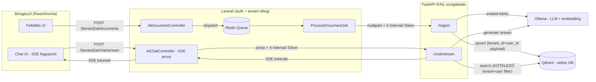

# AI_RAG.md — Helyi RAG-alapú MI csevegőrendszer integrációja

Laravel 12 (Inertia + React) multi-tenant alkalmazáshoz illesztett, szolgáltatásorientált RAG-architektúra: FastAPI mikroszolgáltatás + Ollama + Qdrant + Redis. A projekt meglévő tenant-modelljéhez (slug-alapú routing, per-tenant SQLite) igazítva.

---

## 0. Rövid megvalósítási terv (ütemterv)

1. **Infrastruktúra** — `ai-rag/docker-compose.yml`: Ollama + Qdrant + Redis + FastAPI RAG szolgáltatás elindítása, modellek letöltése (`llama3.1:8b-instruct-q5_K_M`, `bge-m3`).
2. **FastAPI RAG mag** — `/ingest` (parse → chunk → embed → Qdrant upsert), `/chat/stream` (SSE), `/documents/{id}` (törlés). Belső HMAC-token auth, kötelező `tenant_id`+`user_id` payload-szűrés.
3. **Laravel réteg** — migráció (`ai_documents`, tenant DB), `AiDocument` model, `AiDocumentController` (upload), `ProcessDocumentJob` (Redis queue), `AiChatController` (SSE proxy), route-ok, `.env` bővítés.
4. **Frontend** — React chat komponens `fetch` streammel (SSE parse), feltöltő UI.
5. **Hardening** — Redis queue átállás (`QUEUE_CONNECTION=redis`), rate limit a chat végponton, Qdrant payload indexek, terheléses teszt 50–100 párhuzamos felhasználóra.

Fejlesztési sorrend: 1 → 2 → 3 → 4 → 5. A 2. és 3. pont párhuzamosan is haladhat, mert a köztük lévő szerződés (API kontraktus) az 1. fejezet végén rögzített.

---

## 1. Architektúra diagram és adatfolyam

### Könyvtárszerkezet

```
KulcsNyilvantarto/
├── ai-rag/
│   ├── docker-compose.yml
│   ├── .env.example
│   └── rag-service/
│       ├── Dockerfile
│       ├── requirements.txt
│       └── app/
│           ├── __init__.py
│           ├── main.py          # FastAPI végpontok
│           ├── config.py        # beállítások (env-ből)
│           ├── security.py      # belső token validáció
│           ├── loaders.py       # memória-biztos dokumentum-parserek
│           ├── ingestion.py     # chunking + embedding + Qdrant upsert
│           └── rag.py           # retrieval + Ollama streaming
├── app/
│   ├── Http/Controllers/
│   │   ├── AiDocumentController.php
│   │   └── AiChatController.php
│   ├── Jobs/ProcessDocumentJob.php
│   └── Models/AiDocument.php
└── database/migrations/tenant/
    └── 2026_07_04_000000_create_ai_documents_table.php
```

### Mermaid diagram



### Dokumentum-beviteli folyamat (Document Ingestion Flow)

1. A felhasználó feltölt egy fájlt (`.pdf/.docx/.xlsx/.txt`, max 20 MB). A `AiDocumentController` validál, a fájlt `storage/app/ai-documents/{tenant}/{user_id}/` alá menti, `AiDocument` rekordot hoz létre `pending` státusszal, és dispatch-eli a `ProcessDocumentJob`-ot. **A webes kérés itt véget ér (< 200 ms).**
2. A Redis queue worker felveszi a jobot, és multipart POST-tal elküldi a fájlt a FastAPI `/ingest` végpontjára — a `tenant_id`, `user_id`, `document_id` metaadatokkal és a belső tokennel.
3. A FastAPI streamelve parseolja a fájlt (memória-biztos loaderek), 1000 karakteres, 150 átfedésű chunkokra bontja, az Ollama `bge-m3` modellel batch-ekben beágyazza, majd Qdrant-ba upserteli — minden pont payloadja tartalmazza a `tenant_id`, `user_id`, `document_id` mezőket.
4. A job a válasz alapján `ready` (chunk-számmal) vagy `failed` státuszra frissíti az `AiDocument` rekordot. Hiba esetén a Laravel queue retry mechanizmusa (3 próba, backoff) érvényesül.

### Csevegési lekérdezés és streamelés (Chat Query & Streaming Flow)

1. A React chat `fetch`-csel POST-ol a `/{tenant}/ai/chat/stream` route-ra (session auth + CSRF).
2. Az `AiChatController` a **session-ből** veszi a `tenant_id`-t és `user_id`-t (a kliens sosem adhatja meg), majd streaming HTTP kapcsolatot nyit a FastAPI `/chat/stream` felé.
3. A FastAPI a kérdést beágyazza, Qdrant-ban keres **kötelező `must` filterrel** (`tenant_id` ÉS `user_id`), a top-5 chunkból kontextust épít, és context-bounding system prompttal hívja az Ollamát.
4. Az Ollama tokenjeit a FastAPI SSE eseményekként streameli → a Laravel bufferelés nélkül továbbítja (`X-Accel-Buffering: no`) → a React token-enként rendereli. Time-To-First-Token jellemzően < 1,5 s.

---

## 2. Éles üzemre kész Docker Compose beállítás

### `ai-rag/.env.example`

```env
# Erős, véletlen titok — a Laravel .env RAG_INTERNAL_TOKEN értékével azonos!
RAG_INTERNAL_TOKEN=change-me-openssl-rand-hex-32

OLLAMA_LLM_MODEL=llama3.1:8b-instruct-q5_K_M
OLLAMA_EMBED_MODEL=bge-m3
QDRANT_COLLECTION=enterprise_docs
```

### `ai-rag/docker-compose.yml`

```yaml
name: kulcs-ai-rag

services:
  ollama:
    image: ollama/ollama:latest
    container_name: rag-ollama
    restart: unless-stopped
    volumes:
      - ollama_models:/root/.ollama
    environment:
      # Párhuzamos kérések kiszolgálása: 4 párhuzamos generálás / modell.
      # 50-100 user esetén a kérések sorban állnak — ez normális, az SSE miatt
      # az észlelt késleltetés alacsony marad.
      OLLAMA_NUM_PARALLEL: "4"
      OLLAMA_MAX_LOADED_MODELS: "2"     # LLM + embedding modell egyszerre
      OLLAMA_KEEP_ALIVE: "24h"          # ne unloadolja a modelleket
    # GPU-gyorsítás (NVIDIA): komment nélkül aktív, CPU-n hagyd kikommentezve.
    # deploy:
    #   resources:
    #     reservations:
    #       devices:
    #         - driver: nvidia
    #           count: all
    #           capabilities: [gpu]
    healthcheck:
      test: ["CMD", "ollama", "ls"]
      interval: 30s
      timeout: 10s
      retries: 5
    networks: [rag-net]

  # Egyszeri modell-letöltés induláskor (idempotens)
  ollama-init:
    image: ollama/ollama:latest
    depends_on:
      ollama:
        condition: service_healthy
    environment:
      OLLAMA_HOST: http://ollama:11434
    entrypoint: >
      sh -c "ollama pull ${OLLAMA_LLM_MODEL:-llama3.1:8b-instruct-q5_K_M} &&
             ollama pull ${OLLAMA_EMBED_MODEL:-bge-m3}"
    networks: [rag-net]
    restart: "no"

  qdrant:
    image: qdrant/qdrant:v1.13.4
    container_name: rag-qdrant
    restart: unless-stopped
    volumes:
      - qdrant_data:/qdrant/storage
    environment:
      QDRANT__SERVICE__MAX_REQUEST_SIZE_MB: "64"
    healthcheck:
      test: ["CMD-SHELL", "bash -c ':> /dev/tcp/127.0.0.1/6333' || exit 1"]
      interval: 15s
      timeout: 5s
      retries: 5
    networks: [rag-net]

  redis:
    image: redis:7-alpine
    container_name: rag-redis
    restart: unless-stopped
    command: redis-server --appendonly yes --maxmemory 512mb --maxmemory-policy noeviction
    volumes:
      - redis_data:/data
    # A Laravel queue worker eléri a hoszton:
    ports:
      - "127.0.0.1:6379:6379"
    healthcheck:
      test: ["CMD", "redis-cli", "ping"]
      interval: 15s
      timeout: 5s
      retries: 5
    networks: [rag-net]

  rag-api:
    build:
      context: ./rag-service
    container_name: rag-api
    restart: unless-stopped
    environment:
      RAG_INTERNAL_TOKEN: ${RAG_INTERNAL_TOKEN:?RAG_INTERNAL_TOKEN kötelező}
      OLLAMA_BASE_URL: http://ollama:11434
      QDRANT_URL: http://qdrant:6333
      QDRANT_COLLECTION: ${QDRANT_COLLECTION:-enterprise_docs}
      OLLAMA_LLM_MODEL: ${OLLAMA_LLM_MODEL:-llama3.1:8b-instruct-q5_K_M}
      OLLAMA_EMBED_MODEL: ${OLLAMA_EMBED_MODEL:-bge-m3}
    depends_on:
      ollama:
        condition: service_healthy
      qdrant:
        condition: service_healthy
    # Csak localhostra kötve — a Laravel proxyzza, publikusan SOHA nem elérhető.
    ports:
      - "127.0.0.1:8100:8100"
    healthcheck:
      test: ["CMD-SHELL", "python -c \"import urllib.request; urllib.request.urlopen('http://127.0.0.1:8100/health', timeout=5)\""]
      interval: 20s
      timeout: 10s
      retries: 5
    networks: [rag-net]

volumes:
  ollama_models:
  qdrant_data:
  redis_data:

networks:
  rag-net:
    driver: bridge
```

> **Megjegyzés (magyar nyelvű dokumentumok):** a `bge-m3` embedding modell többnyelvű, magyarra is erős. Ha a válaszminőség magyarul gyenge lenne a `llama3.1:8b`-vel, a `qwen2.5:7b-instruct-q5_K_M` jó alternatíva — csak az env változót kell cserélni.

### `ai-rag/rag-service/Dockerfile`

```dockerfile
FROM python:3.12-slim

ENV PYTHONDONTWRITEBYTECODE=1 \
    PYTHONUNBUFFERED=1 \
    PIP_NO_CACHE_DIR=1

WORKDIR /srv

COPY requirements.txt .
RUN pip install --no-cache-dir -r requirements.txt

COPY app ./app

# Nem-root futtatás
RUN useradd --create-home appuser
USER appuser

EXPOSE 8100

# 4 worker: az I/O-kötött SSE proxy + async végpontok miatt bőven elég 100 userre
CMD ["uvicorn", "app.main:app", "--host", "0.0.0.0", "--port", "8100", "--workers", "4"]
```

---

## 3. Python FastAPI RAG mikroszolgáltatás

Szándékosan **nem** húzunk be teljes LangChain/LlamaIndex framework-öt: a stabil, karcsú megoldás a `qdrant-client` + közvetlen Ollama HTTP + a LangChain-ből kiemelt, önállóan is stabil `langchain-text-splitters` csomag a chunkoláshoz. Kevesebb dependency = kevesebb törés, gyorsabb hidegindulás, könnyebb audit.

### `ai-rag/rag-service/requirements.txt`

```txt
fastapi==0.115.12
uvicorn[standard]==0.34.0
httpx==0.28.1
qdrant-client==1.13.3
langchain-text-splitters==0.3.8
python-multipart==0.0.20
pypdf==5.4.0
python-docx==1.1.2
openpyxl==3.1.5
sse-starlette==2.2.1
pydantic-settings==2.8.1
```

### `ai-rag/rag-service/app/config.py`

```python
from pydantic_settings import BaseSettings


class Settings(BaseSettings):
    rag_internal_token: str
    ollama_base_url: str = "http://ollama:11434"
    qdrant_url: str = "http://qdrant:6333"
    qdrant_collection: str = "enterprise_docs"
    ollama_llm_model: str = "llama3.1:8b-instruct-q5_K_M"
    ollama_embed_model: str = "bge-m3"

    # Chunking
    chunk_size: int = 1000
    chunk_overlap: int = 150
    embed_batch_size: int = 32

    # Retrieval
    top_k: int = 5
    score_threshold: float = 0.35

    # Memória-védelem parseolásnál
    max_cell_chars: int = 2000        # xlsx cellánkénti plafon
    max_document_chars: int = 2_000_000  # ~2 MB tiszta szöveg / dokumentum


settings = Settings()
```

### `ai-rag/rag-service/app/security.py`

```python
import hmac

from fastapi import Header, HTTPException

from .config import settings


def verify_internal_token(x_internal_token: str = Header(default="")) -> None:
    """Csak a Laravel backend hívhatja a szolgáltatást (megosztott titok).

    hmac.compare_digest: timing-attack-biztos összehasonlítás.
    """
    if not x_internal_token or not hmac.compare_digest(
        x_internal_token, settings.rag_internal_token
    ):
        raise HTTPException(status_code=401, detail="Invalid internal token")
```

### `ai-rag/rag-service/app/loaders.py`

```python
"""Memória-biztos szövegkinyerés .pdf / .docx / .xlsx / .txt fájlokból.

Minden loader generátor: szakaszonként yield-el, sosem materializálja a teljes
dokumentumot egyetlen stringként. A hívó (ingestion) felel a globális
karakterlimit betartásáért.
"""
from __future__ import annotations

import io
from typing import Iterator

from .config import settings


def load_txt(data: bytes) -> Iterator[str]:
    text = data.decode("utf-8", errors="replace")
    # 64k-s szeletekben adjuk tovább, hogy a splitter kezelhető darabokat kapjon
    for i in range(0, len(text), 65536):
        yield text[i : i + 65536]


def load_pdf(data: bytes) -> Iterator[str]:
    from pypdf import PdfReader

    reader = PdfReader(io.BytesIO(data))
    for page in reader.pages:
        text = page.extract_text() or ""
        if text.strip():
            yield text


def load_docx(data: bytes) -> Iterator[str]:
    import docx

    document = docx.Document(io.BytesIO(data))
    for para in document.paragraphs:
        if para.text.strip():
            yield para.text
    # Táblázatok: sorok tabulátorral összefűzve — a struktúra részben megmarad
    for table in document.tables:
        for row in table.rows:
            cells = [c.text.strip() for c in row.cells if c.text.strip()]
            if cells:
                yield "\t".join(cells)


def load_xlsx(data: bytes) -> Iterator[str]:
    """read_only + iter_rows: az openpyxl soronként streamel, nem tölti be
    a teljes munkafüzetet a memóriába. Cellánkénti karakterplafon védi a
    degenerált (óriás szöveget tartalmazó) cellák elleni esetet.
    """
    from openpyxl import load_workbook

    wb = load_workbook(io.BytesIO(data), read_only=True, data_only=True)
    try:
        for ws in wb.worksheets:
            yield f"[Munkalap: {ws.title}]"
            for row in ws.iter_rows(values_only=True):
                cells = [
                    str(v)[: settings.max_cell_chars]
                    for v in row
                    if v is not None and str(v).strip()
                ]
                if cells:
                    yield "\t".join(cells)
    finally:
        wb.close()


LOADERS = {
    ".txt": load_txt,
    ".pdf": load_pdf,
    ".docx": load_docx,
    ".xlsx": load_xlsx,
}


def extract_text(filename: str, data: bytes) -> Iterator[str]:
    ext = "." + filename.rsplit(".", 1)[-1].lower() if "." in filename else ""
    loader = LOADERS.get(ext)
    if loader is None:
        raise ValueError(f"Nem támogatott fájltípus: {ext or filename}")
    return loader(data)
```

### `ai-rag/rag-service/app/ingestion.py`

```python
"""Chunking → embedding → Qdrant upsert, szigorú tenant/user payloaddal."""
from __future__ import annotations

import uuid

import httpx
from langchain_text_splitters import RecursiveCharacterTextSplitter
from qdrant_client import AsyncQdrantClient, models

from .config import settings
from .loaders import extract_text

_splitter = RecursiveCharacterTextSplitter(
    chunk_size=settings.chunk_size,
    chunk_overlap=settings.chunk_overlap,
    separators=["\n\n", "\n", ". ", " ", ""],
)

qdrant = AsyncQdrantClient(url=settings.qdrant_url)


async def ensure_collection() -> None:
    """Kollekció + payload indexek létrehozása (idempotens, app-indításkor fut)."""
    if not await qdrant.collection_exists(settings.qdrant_collection):
        # bge-m3 → 1024 dimenzió
        await qdrant.create_collection(
            collection_name=settings.qdrant_collection,
            vectors_config=models.VectorParams(
                size=1024, distance=models.Distance.COSINE
            ),
        )
    # Keyword payload indexek: a tenant/user szűrés így index-alapú, nem scan
    for field in ("tenant_id", "user_id", "document_id"):
        try:
            await qdrant.create_payload_index(
                collection_name=settings.qdrant_collection,
                field_name=field,
                field_schema=models.PayloadSchemaType.KEYWORD,
            )
        except Exception:
            pass  # már létezik


async def embed_texts(texts: list[str], client: httpx.AsyncClient) -> list[list[float]]:
    """Ollama /api/embed — natívan batch-képes."""
    resp = await client.post(
        f"{settings.ollama_base_url}/api/embed",
        json={"model": settings.ollama_embed_model, "input": texts},
        timeout=300.0,
    )
    resp.raise_for_status()
    return resp.json()["embeddings"]


async def ingest_document(
    *, tenant_id: str, user_id: str, document_id: str, filename: str, data: bytes
) -> int:
    """Feldolgozza a dokumentumot; a beszúrt chunkok számával tér vissza."""
    # 1) Szövegkinyerés streamelve, globális karakterplafonnal
    sections: list[str] = []
    total = 0
    for section in extract_text(filename, data):
        total += len(section)
        if total > settings.max_document_chars:
            sections.append(section[: settings.max_document_chars - (total - len(section))])
            break
        sections.append(section)

    chunks = _splitter.split_text("\n".join(sections))
    if not chunks:
        return 0

    # 2) Re-ingest esetén a régi vektorok törlése (idempotencia)
    await delete_document(tenant_id=tenant_id, user_id=user_id, document_id=document_id)

    # 3) Batch embedding + upsert
    inserted = 0
    async with httpx.AsyncClient() as client:
        for i in range(0, len(chunks), settings.embed_batch_size):
            batch = chunks[i : i + settings.embed_batch_size]
            vectors = await embed_texts(batch, client)
            points = [
                models.PointStruct(
                    id=str(uuid.uuid4()),
                    vector=vec,
                    payload={
                        # IZOLÁCIÓS KULCSOK — minden lekérdezés ezekre szűr
                        "tenant_id": tenant_id,
                        "user_id": user_id,
                        "document_id": document_id,
                        "filename": filename,
                        "chunk_index": i + j,
                        "text": text,
                    },
                )
                for j, (text, vec) in enumerate(zip(batch, vectors))
            ]
            await qdrant.upsert(
                collection_name=settings.qdrant_collection, points=points, wait=True
            )
            inserted += len(points)
    return inserted


async def delete_document(*, tenant_id: str, user_id: str, document_id: str) -> None:
    """Egy dokumentum összes vektorának törlése — tenant+user szűréssel,
    hogy idegen tenant dokumentuma véletlenül se legyen törölhető."""
    await qdrant.delete(
        collection_name=settings.qdrant_collection,
        points_selector=models.FilterSelector(
            filter=models.Filter(
                must=[
                    models.FieldCondition(key="tenant_id", match=models.MatchValue(value=tenant_id)),
                    models.FieldCondition(key="user_id", match=models.MatchValue(value=user_id)),
                    models.FieldCondition(key="document_id", match=models.MatchValue(value=document_id)),
                ]
            )
        ),
        wait=True,
    )
```

### `ai-rag/rag-service/app/rag.py`

```python
"""Retrieval + kontextushoz kötött, streamelt válaszgenerálás."""
from __future__ import annotations

import json
from typing import AsyncIterator

import httpx
from qdrant_client import models

from .config import settings
from .ingestion import embed_texts, qdrant

# Szigorú context-bounding — hallucináció-védelem
SYSTEM_PROMPT = (
    "Te egy vállalati dokumentum-asszisztens vagy. KIZÁRÓLAG a megadott "
    "KONTEXTUS alapján válaszolj, magyarul. Ha a válasz nem található meg a "
    "kontextusban, válaszold pontosan ezt: 'Erre a kérdésre a feltöltött "
    "dokumentumok alapján nem tudok válaszolni.' Ne találj ki információt, "
    "ne használd a saját tudásodat, ne spekulálj. Ha idézel, jelöld meg a "
    "forrás fájlnevét."
)


async def retrieve_context(
    *, tenant_id: str, user_id: str, question: str
) -> list[dict]:
    """Top-K releváns chunk — KÖTELEZŐ tenant+user izolációs szűrővel.

    A filter a szerveroldalon, a Laravel session-ből származó azonosítókkal
    épül. Ez a függvény az egyetlen retrieval-útvonal: szűrő nélküli keresés
    a szolgáltatásban nem létezik.
    """
    async with httpx.AsyncClient() as client:
        query_vec = (await embed_texts([question], client))[0]

    result = await qdrant.query_points(
        collection_name=settings.qdrant_collection,
        query=query_vec,
        limit=settings.top_k,
        score_threshold=settings.score_threshold,
        query_filter=models.Filter(
            must=[
                models.FieldCondition(key="tenant_id", match=models.MatchValue(value=tenant_id)),
                models.FieldCondition(key="user_id", match=models.MatchValue(value=user_id)),
            ]
        ),
        with_payload=True,
    )
    return [
        {"text": p.payload["text"], "filename": p.payload["filename"], "score": p.score}
        for p in result.points
    ]


def build_prompt(question: str, contexts: list[dict], history: list[dict]) -> list[dict]:
    context_block = "\n\n---\n\n".join(
        f"[Forrás: {c['filename']}]\n{c['text']}" for c in contexts
    )
    messages = [{"role": "system", "content": SYSTEM_PROMPT}]
    # Rövid előzmény (max 6 üzenet) a többfordulós beszélgetéshez
    messages.extend(history[-6:])
    messages.append(
        {
            "role": "user",
            "content": f"KONTEXTUS:\n{context_block}\n\nKÉRDÉS: {question}",
        }
    )
    return messages


async def stream_answer(
    *, tenant_id: str, user_id: str, question: str, history: list[dict]
) -> AsyncIterator[dict]:
    """SSE eseményfolyam: sources → token* → done | error."""
    contexts = await retrieve_context(
        tenant_id=tenant_id, user_id=user_id, question=question
    )

    if not contexts:
        yield {"event": "token", "data": (
            "Erre a kérdésre a feltöltött dokumentumok alapján nem tudok válaszolni."
        )}
        yield {"event": "done", "data": ""}
        return

    yield {
        "event": "sources",
        "data": json.dumps(
            sorted({c["filename"] for c in contexts}), ensure_ascii=False
        ),
    }

    payload = {
        "model": settings.ollama_llm_model,
        "messages": build_prompt(question, contexts, history),
        "stream": True,
        "options": {"temperature": 0.1, "num_ctx": 8192},
    }

    async with httpx.AsyncClient(timeout=httpx.Timeout(300.0, connect=10.0)) as client:
        async with client.stream(
            "POST", f"{settings.ollama_base_url}/api/chat", json=payload
        ) as resp:
            resp.raise_for_status()
            async for line in resp.aiter_lines():
                if not line.strip():
                    continue
                data = json.loads(line)
                token = data.get("message", {}).get("content", "")
                if token:
                    yield {"event": "token", "data": token}
                if data.get("done"):
                    break

    yield {"event": "done", "data": ""}
```

### `ai-rag/rag-service/app/main.py`

```python
from __future__ import annotations

import logging
from contextlib import asynccontextmanager

from fastapi import Depends, FastAPI, File, Form, HTTPException, UploadFile
from pydantic import BaseModel, Field
from sse_starlette.sse import EventSourceResponse

from .config import settings
from .ingestion import delete_document, ensure_collection, ingest_document
from .rag import stream_answer
from .security import verify_internal_token

logger = logging.getLogger("rag")

ALLOWED_EXTENSIONS = {".pdf", ".docx", ".xlsx", ".txt"}
MAX_UPLOAD_BYTES = 20 * 1024 * 1024  # 20 MB — Laravel oldalon is érvényesítve


@asynccontextmanager
async def lifespan(app: FastAPI):
    await ensure_collection()
    yield


app = FastAPI(title="RAG Service", docs_url=None, redoc_url=None, lifespan=lifespan)


@app.get("/health")
async def health() -> dict:
    return {"status": "ok"}


@app.post("/ingest", dependencies=[Depends(verify_internal_token)])
async def ingest(
    file: UploadFile = File(...),
    tenant_id: str = Form(...),
    user_id: str = Form(...),
    document_id: str = Form(...),
) -> dict:
    ext = "." + (file.filename or "").rsplit(".", 1)[-1].lower()
    if ext not in ALLOWED_EXTENSIONS:
        raise HTTPException(422, f"Nem támogatott fájltípus: {ext}")

    data = await file.read()
    if len(data) > MAX_UPLOAD_BYTES:
        raise HTTPException(413, "A fájl túl nagy (max 20 MB).")

    try:
        chunks = await ingest_document(
            tenant_id=tenant_id,
            user_id=user_id,
            document_id=document_id,
            filename=file.filename or "unknown",
            data=data,
        )
    except ValueError as e:
        raise HTTPException(422, str(e))
    except Exception:
        logger.exception("Ingest hiba: doc=%s tenant=%s", document_id, tenant_id)
        raise HTTPException(500, "Feldolgozási hiba")

    return {"status": "ok", "chunks": chunks}


class ChatRequest(BaseModel):
    tenant_id: str = Field(min_length=1, max_length=64)
    user_id: str = Field(min_length=1, max_length=64)
    question: str = Field(min_length=1, max_length=4000)
    history: list[dict] = Field(default_factory=list, max_length=20)


@app.post("/chat/stream", dependencies=[Depends(verify_internal_token)])
async def chat_stream(req: ChatRequest) -> EventSourceResponse:
    async def generator():
        try:
            async for event in stream_answer(
                tenant_id=req.tenant_id,
                user_id=req.user_id,
                question=req.question,
                history=req.history,
            ):
                yield event
        except Exception:
            logger.exception("Chat stream hiba: tenant=%s", req.tenant_id)
            yield {"event": "error", "data": "Belső hiba történt."}

    return EventSourceResponse(generator())


@app.delete("/documents/{document_id}", dependencies=[Depends(verify_internal_token)])
async def remove_document(
    document_id: str, tenant_id: str, user_id: str
) -> dict:
    await delete_document(
        tenant_id=tenant_id, user_id=user_id, document_id=document_id
    )
    return {"status": "deleted"}
```

---

## 4. Laravel integrációs réteg

### `.env` kiegészítés (Laravel)

```env
QUEUE_CONNECTION=redis
REDIS_HOST=127.0.0.1
REDIS_PORT=6379

RAG_SERVICE_URL=http://127.0.0.1:8100
RAG_INTERNAL_TOKEN=change-me-openssl-rand-hex-32   # azonos az ai-rag/.env értékével
```

`config/services.php` kiegészítés:

```php
'rag' => [
    'url' => env('RAG_SERVICE_URL', 'http://127.0.0.1:8100'),
    'token' => env('RAG_INTERNAL_TOKEN'),
],
```

### Migráció — `database/migrations/tenant/2026_07_04_000000_create_ai_documents_table.php`

A projekt tenant-migrációs konvencióját követi (per-tenant SQLite, `tenants:migrate-all`).

```php
<?php

use Illuminate\Database\Migrations\Migration;
use Illuminate\Database\Schema\Blueprint;
use Illuminate\Support\Facades\Schema;

return new class extends Migration
{
    public function up(): void
    {
        Schema::connection('tenant')->create('ai_documents', function (Blueprint $table) {
            $table->id();
            $table->unsignedBigInteger('user_id')->index();
            $table->string('original_name');
            $table->string('stored_path');
            $table->unsignedBigInteger('size_bytes');
            $table->string('status')->default('pending'); // pending|processing|ready|failed
            $table->unsignedInteger('chunk_count')->default(0);
            $table->text('error_message')->nullable();
            $table->timestamps();
        });
    }

    public function down(): void
    {
        Schema::connection('tenant')->dropIfExists('ai_documents');
    }
};
```

### Model — `app/Models/AiDocument.php`

```php
<?php

namespace App\Models;

use Illuminate\Database\Eloquent\Model;

class AiDocument extends Model
{
    protected $connection = 'tenant';

    protected $fillable = [
        'user_id', 'original_name', 'stored_path', 'size_bytes',
        'status', 'chunk_count', 'error_message',
    ];
}
```

### Controller — `app/Http/Controllers/AiDocumentController.php`

```php
<?php

namespace App\Http\Controllers;

use App\Jobs\ProcessDocumentJob;
use App\Models\AiDocument;
use Illuminate\Http\RedirectResponse;
use Illuminate\Http\Request;
use Illuminate\Support\Facades\Storage;
use Inertia\Inertia;
use Inertia\Response;

class AiDocumentController extends Controller
{
    public function index(Request $request): Response
    {
        return Inertia::render('Ai/Documents', [
            'documents' => AiDocument::where('user_id', $request->user('tenant_user')->id)
                ->latest()
                ->get(['id', 'original_name', 'status', 'chunk_count', 'size_bytes', 'created_at']),
        ]);
    }

    public function store(Request $request): RedirectResponse
    {
        $request->validate([
            'file' => ['required', 'file', 'max:20480', 'mimes:pdf,docx,xlsx,txt'],
        ]);

        $tenant = app('tenant');
        $user = $request->user('tenant_user');
        $file = $request->file('file');

        $path = $file->store("ai-documents/{$tenant->slug}/{$user->id}", 'local');

        $document = AiDocument::create([
            'user_id' => $user->id,
            'original_name' => $file->getClientOriginalName(),
            'stored_path' => $path,
            'size_bytes' => $file->getSize(),
            'status' => 'pending',
        ]);

        ProcessDocumentJob::dispatch($tenant->slug, $user->id, $document->id);

        return back()->with('success', 'A dokumentum feldolgozása elindult.');
    }

    public function destroy(Request $request, AiDocument $document): RedirectResponse
    {
        $user = $request->user('tenant_user');
        abort_unless($document->user_id === $user->id, 403);

        $tenant = app('tenant');

        \Illuminate\Support\Facades\Http::withHeaders([
            'X-Internal-Token' => config('services.rag.token'),
        ])->delete(config('services.rag.url') . "/documents/{$document->id}", [
            'tenant_id' => $tenant->slug,
            'user_id' => (string) $user->id,
        ])->throw();

        Storage::disk('local')->delete($document->stored_path);
        $document->delete();

        return back()->with('success', 'Dokumentum törölve.');
    }
}
```

### Job — `app/Jobs/ProcessDocumentJob.php`

A queue worker tenant-kontextus nélkül fut, ezért a job maga állítja be a tenant kapcsolatot (ugyanazzal a mintával, mint a `TenantMiddleware`).

```php
<?php

namespace App\Jobs;

use App\Models\AiDocument;
use Illuminate\Bus\Queueable;
use Illuminate\Contracts\Queue\ShouldQueue;
use Illuminate\Foundation\Bus\Dispatchable;
use Illuminate\Queue\InteractsWithQueue;
use Illuminate\Queue\SerializesModels;
use Illuminate\Support\Facades\DB;
use Illuminate\Support\Facades\Http;
use Illuminate\Support\Facades\Storage;

class ProcessDocumentJob implements ShouldQueue
{
    use Dispatchable, InteractsWithQueue, Queueable, SerializesModels;

    public int $tries = 3;
    public int $timeout = 900; // nagy fájl + CPU-s embedding esetére

    public array $backoff = [30, 120];

    public function __construct(
        public string $tenantSlug,
        public int $userId,
        public int $documentId,
    ) {}

    public function handle(): void
    {
        $this->bindTenantConnection();

        $document = AiDocument::find($this->documentId);
        if (!$document) {
            return;
        }

        $document->update(['status' => 'processing']);

        $absolutePath = Storage::disk('local')->path($document->stored_path);

        $response = Http::withHeaders([
                'X-Internal-Token' => config('services.rag.token'),
            ])
            ->timeout(840)
            ->attach('file', fopen($absolutePath, 'r'), $document->original_name)
            ->post(config('services.rag.url') . '/ingest', [
                'tenant_id' => $this->tenantSlug,
                'user_id' => (string) $this->userId,
                'document_id' => (string) $document->id,
            ]);

        if ($response->failed()) {
            throw new \RuntimeException(
                'RAG ingest hiba: HTTP ' . $response->status() . ' — ' . $response->body()
            );
        }

        $document->update([
            'status' => 'ready',
            'chunk_count' => $response->json('chunks', 0),
            'error_message' => null,
        ]);
    }

    public function failed(\Throwable $e): void
    {
        $this->bindTenantConnection();

        AiDocument::where('id', $this->documentId)->update([
            'status' => 'failed',
            'error_message' => mb_substr($e->getMessage(), 0, 1000),
        ]);
    }

    private function bindTenantConnection(): void
    {
        config([
            'database.connections.tenant.database' =>
                storage_path('database/tenants/' . $this->tenantSlug . '.sqlite'),
        ]);
        DB::purge('tenant');
    }
}
```

### Streaming Chat Controller — `app/Http/Controllers/AiChatController.php`

A `tenant_id` és `user_id` **kizárólag** a szerveroldali kontextusból származik — a kliens csak a kérdést és az előzményt küldheti.

```php
<?php

namespace App\Http\Controllers;

use Illuminate\Http\Request;
use Illuminate\Support\Facades\Http;
use Inertia\Inertia;
use Inertia\Response;
use Symfony\Component\HttpFoundation\StreamedResponse;

class AiChatController extends Controller
{
    public function show(): Response
    {
        return Inertia::render('Ai/Chat');
    }

    public function stream(Request $request): StreamedResponse
    {
        $validated = $request->validate([
            'question' => ['required', 'string', 'max:4000'],
            'history' => ['sometimes', 'array', 'max:20'],
            'history.*.role' => ['required_with:history', 'in:user,assistant'],
            'history.*.content' => ['required_with:history', 'string', 'max:8000'],
        ]);

        $tenant = app('tenant');
        $user = $request->user('tenant_user');

        return response()->stream(function () use ($validated, $tenant, $user) {
            // Guzzle stream a FastAPI felé — a body-t chunkonként továbbítjuk
            $response = Http::withHeaders([
                    'X-Internal-Token' => config('services.rag.token'),
                    'Accept' => 'text/event-stream',
                ])
                ->withOptions(['stream' => true])
                ->timeout(300)
                ->post(config('services.rag.url') . '/chat/stream', [
                    'tenant_id' => $tenant->slug,
                    'user_id' => (string) $user->id,
                    'question' => $validated['question'],
                    'history' => $validated['history'] ?? [],
                ]);

            $body = $response->toPsrResponse()->getBody();

            while (!$body->eof()) {
                $chunk = $body->read(1024);
                if ($chunk !== '') {
                    echo $chunk;
                    if (ob_get_level() > 0) {
                        ob_flush();
                    }
                    flush();
                }
                if (connection_aborted()) {
                    break;
                }
            }
        }, 200, [
            'Content-Type' => 'text/event-stream',
            'Cache-Control' => 'no-cache, no-transform',
            'Connection' => 'keep-alive',
            'X-Accel-Buffering' => 'no', // nginx: bufferelés kikapcsolása
        ]);
    }
}
```

### Route-ok — `routes/web.php` kiegészítés

A meglévő tenant route-csoportba illesztve (auth:tenant_user + tenant middleware mögé):

```php
use App\Http\Controllers\AiChatController;
use App\Http\Controllers\AiDocumentController;

// A meglévő Route::prefix('{tenant}')->middleware(['tenant', ...]) csoporton belül:
Route::middleware('auth:tenant_user')->group(function () {
    Route::get('/ai/documents', [AiDocumentController::class, 'index'])->name('ai.documents');
    Route::post('/ai/documents', [AiDocumentController::class, 'store'])->name('ai.documents.store');
    Route::delete('/ai/documents/{document}', [AiDocumentController::class, 'destroy'])->name('ai.documents.destroy');

    Route::get('/ai/chat', [AiChatController::class, 'show'])->name('ai.chat');
    Route::post('/ai/chat/stream', [AiChatController::class, 'stream'])
        ->middleware('throttle:20,1') // rate limit: 20 kérdés / perc / user
        ->name('ai.chat.stream');
});
```

### Frontend — SSE fogyasztás React-ből (vázlat)

`EventSource` nem tud POST-ot, ezért `fetch` + manuális SSE parse:

```tsx
async function askQuestion(question: string, history: Msg[], onToken: (t: string) => void) {
    const response = await fetch(route('ai.chat.stream'), {
        method: 'POST',
        headers: {
            'Content-Type': 'application/json',
            'X-XSRF-TOKEN': decodeURIComponent(
                document.cookie.match(/XSRF-TOKEN=([^;]+)/)?.[1] ?? ''
            ),
        },
        body: JSON.stringify({ question, history }),
    });

    const reader = response.body!.getReader();
    const decoder = new TextDecoder();
    let buffer = '';

    while (true) {
        const { done, value } = await reader.read();
        if (done) break;
        buffer += decoder.decode(value, { stream: true });

        // SSE események: "event: token\ndata: ...\n\n"
        const events = buffer.split('\n\n');
        buffer = events.pop() ?? '';
        for (const raw of events) {
            const event = raw.match(/^event: (.+)$/m)?.[1];
            const data = raw.match(/^data: (.*)$/m)?.[1] ?? '';
            if (event === 'token') onToken(data);
            if (event === 'error') throw new Error(data);
        }
    }
}
```

---

## 5. Biztonsági stratégia — felhasználónkénti vektor-izoláció

1. **Egyetlen belépési pont a bizalmi zónába.** A FastAPI csak `127.0.0.1:8100`-on figyel; kizárólag a Laravel érheti el, `X-Internal-Token` HMAC-összehasonlítással validált megosztott titokkal. Az Ollama és a Qdrant portjai egyáltalán nincsenek publikálva — csak a belső Docker-hálózaton élnek.
2. **Az identitás sosem a klienstől jön.** A `tenant_id` (tenant slug) és `user_id` a Laravel session-ből / a `TenantMiddleware` által kötött tenant-kontextusból származik. A chat request body-ban a felhasználó csak `question`-t és `history`-t küldhet.
3. **Kötelező szerveroldali szűrés minden vektorműveletnél.** A `retrieve_context` és a `delete_document` is `must` filterrel (`tenant_id` ÉS `user_id`) fut; szűrő nélküli lekérdezési útvonal a kódbázisban nem létezik. A payload mezőkön keyword indexek biztosítják, hogy a szűrés index-alapú legyen (teljesítmény + skálázhatóság).
4. **Hallucináció-védelem.** A system prompt kizárólag a megadott kontextusból engedi a válaszadást; üres retrieval-találat esetén az LLM meg sem hívódik — determinisztikus "nem tudom" válasz megy vissza.
5. **Erőforrás-védelem.** Fájlméret-limit (20 MB) mindkét oldalon, karakterplafon dokumentumonként és cellánként, kérdéshossz-limit, history-limit, rate limit (`throttle:20,1`) a chat végponton.

---

## Üzembe helyezés (gyorsreferencia)

```bash
# 1. Infrastruktúra
cd ai-rag && cp .env.example .env   # tokent generálni: openssl rand -hex 32
docker compose up -d --build        # az ollama-init letölti a modelleket

# 2. Laravel
#    .env: QUEUE_CONNECTION=redis + RAG_* változók
php artisan tenants:migrate-all     # ai_documents tábla minden tenant DB-be
php artisan queue:work redis --timeout=900   # worker (Supervisor/Coolify alatt)
```
